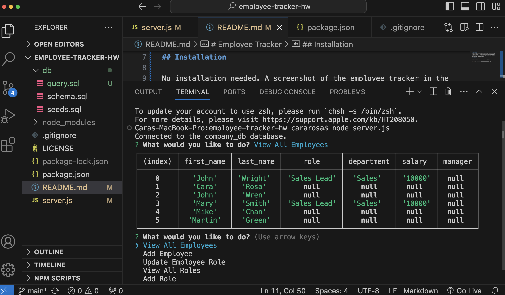

# Employee Tracker

## Description

The Employee Tracker application is designed for companies to be able to have an overview of data on their employees and their departments. In addition, companies can update the data by adding employees, updating employees roles, viewing all roles, adding roles, viewig all departments, and adding departments.

## Installation

No installation needed.

A demo video of the app is below:
[Employee Tracker Demo Video](https://drive.google.com/file/d/1rlJaSUkOjCPQOgZW7qYB-w1b45zbHemc/view).

A screenshot of the employee tracker in the terminal is below:

## Credits

My tutor was able to help me set up mysql2. He also helped with creating the functions of viewAllEmployees and addEmployee found in server.js. In addition, he pointed out that I needed to add logic that would allow the user to select an option and then be directed back to the main menu. He helped with building that code in server.js. The tutor also helped me in changing name to to department_name as name is a reserved word in mysql in query.sql. He also pointed out that the data in my seeds.sql file should be altered as it would make more sense. He changed my department_id number to 1, made the manager_id to null , and changed the  role_id to 1 in seeds.sql. The teacher helped me use a promise in my updateEmployeePromise function to get an employee id back. This code can be found in server.js

## License

A license is not applied to this application.
